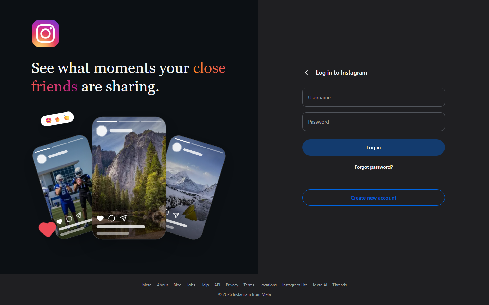
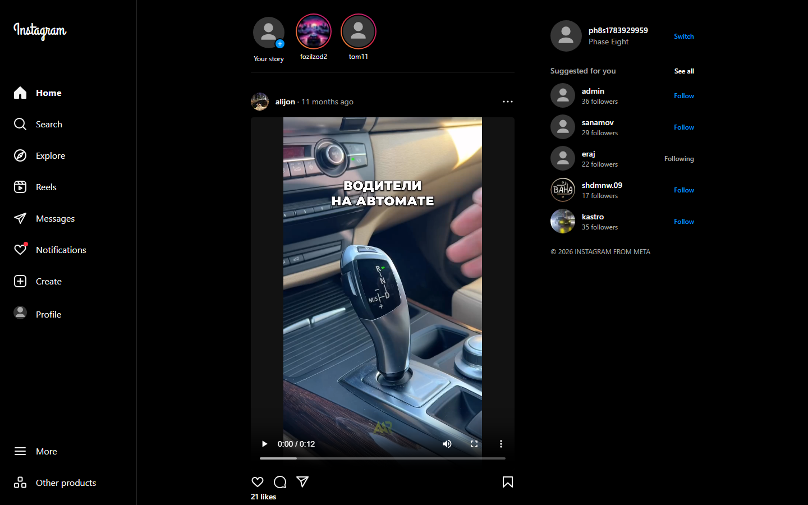
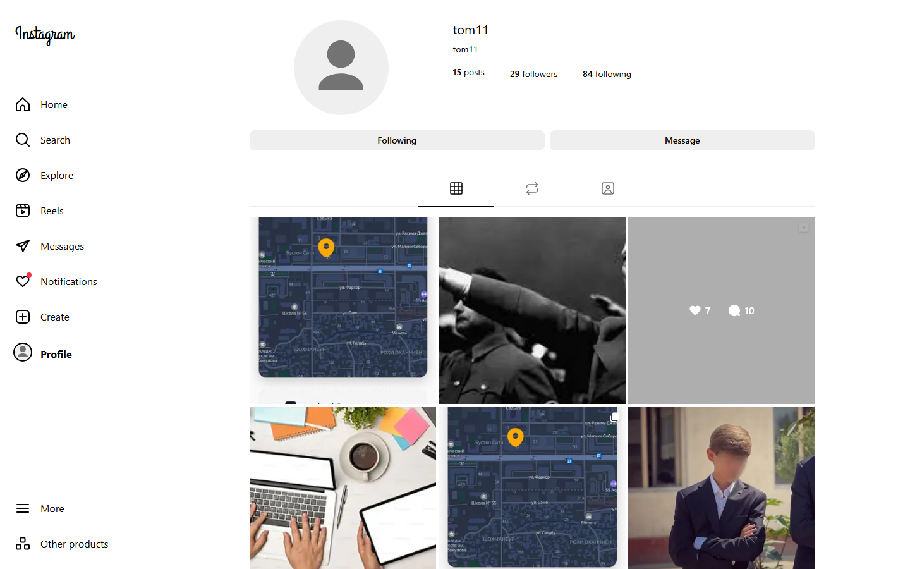
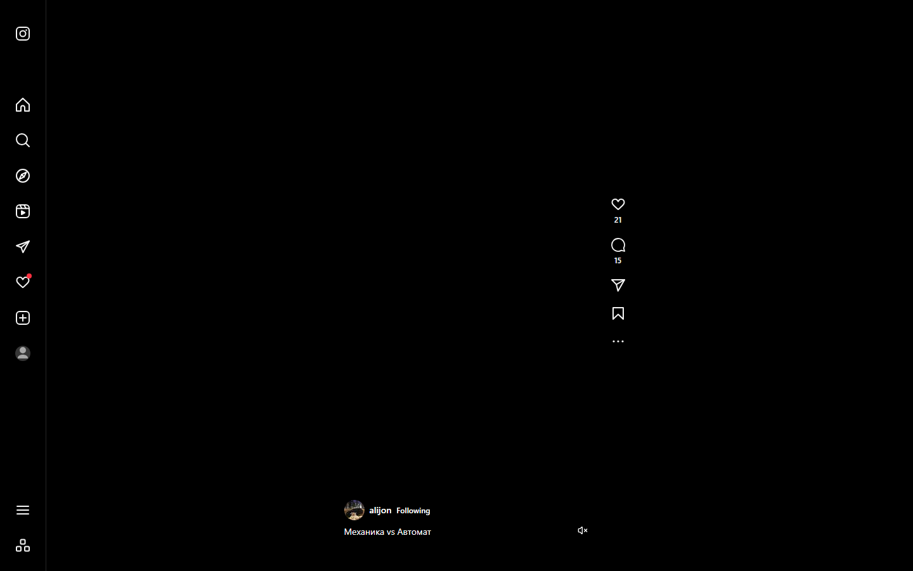
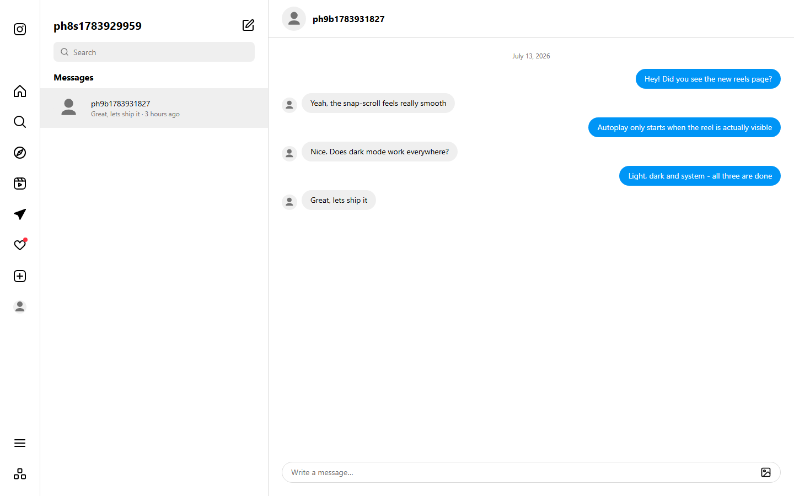
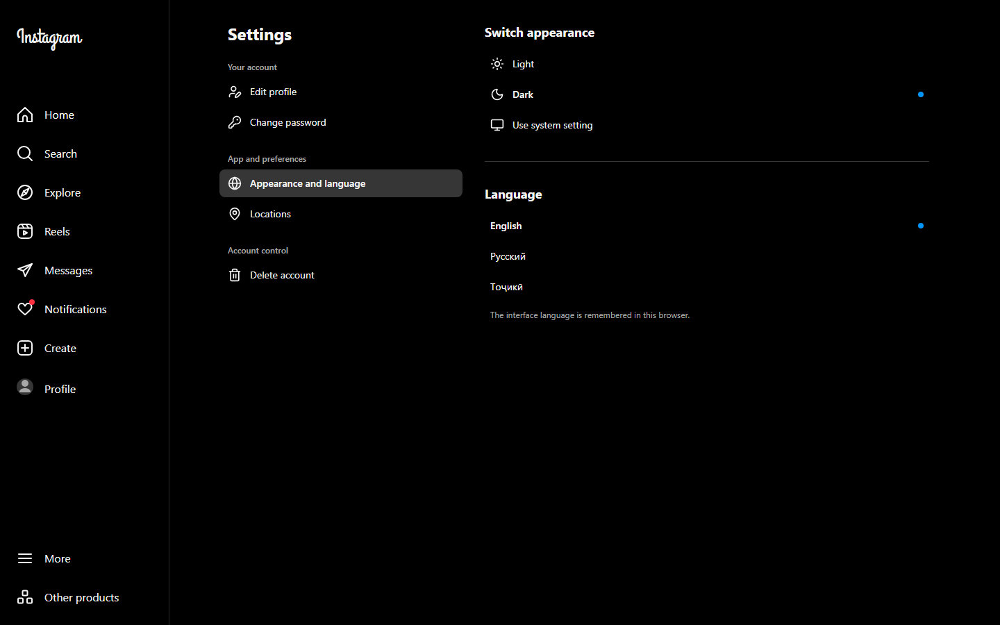

# Instagram Clone

An Instagram clone built with **Next.js 16** (App Router) against a live REST backend.
All **57 / 57 API endpoints** are implemented and actually wired into the UI — not merely written as
services. The design is taken from real Instagram screenshots (`docs/screenshots/`), measured to
±2px rather than approximated.

Backend: `https://instagram-api.softclub.tj`

---

## Screenshots

Login — the promo collage floats on its own and fans out on hover:



| Feed — dark                         | Profile — light                            |
| ----------------------------------- | ------------------------------------------ |
|  |  |

| Reels — dark                          | Chat — light                         |
| ------------------------------------- | ------------------------------------ |
|  |  |

| Settings — appearance and language          |
| ------------------------------------------- |
|  |

---

## Tech stack

| Area           | Choice                                         |
| -------------- | ---------------------------------------------- |
| Framework      | Next.js 16 (App Router, `src/`, Turbopack)     |
| Language       | TypeScript (strict, `any` banned)              |
| Styling        | Tailwind CSS v4 + shadcn/ui                    |
| Server state   | TanStack Query v5                              |
| Client state   | Zustand                                        |
| Forms          | react-hook-form + Zod                          |
| i18n           | next-intl (EN / RU / TJ)                       |
| Theming        | next-themes (light / dark / system)            |
| Motion & media | framer-motion, embla-carousel, react-easy-crop |
| HTTP           | Axios                                          |

---

## Features

- **Feed** — posts from the people you follow, skeletons, optimistic likes and saves, double-tap heart
- **Reels** — snap-scroll, autoplay on visibility, mute toggle, keyboard control (↑ ↓ Space M)
- **Explore** — 4-column grid with an inline search dropdown
- **Stories** — full-screen viewer with progress bars, tap / swipe / hold-to-pause, upload, likes, viewer counts
- **Chat** — 1-to-1 messages, image and video attachments (multipart), 5s polling, optimistic send
- **Search** — 400ms debounce, server-side history for both typed queries and visited profiles
- **Profile** — optimistic follow / unfollow, followers and following, edit profile, avatar upload, saved posts
- **Post create** — drag & drop, crop (1:1 / 4:5), caption
- **Settings** — appearance (light / dark / system), language (EN / RU / TJ), locations CRUD
- **Auth** — register, login, forgot / reset / change password, guarded routes
- **"Continue as …"** — a browser that has signed in before is greeted with the saved account
  instead of an empty form, plus a gear → "Remove profiles from this browser". No token is kept in
  that list, so continuing still asks for the password

The app opens in **dark** by default; light and system are one click away in Settings, and every
screen is built for both.

Every screen implements all three states: **loading (skeleton) · empty · error**.

### Customising the login collage

The three floating story cards on the login screen live in one file:

| What                            | Where                                                    |
| ------------------------------- | -------------------------------------------------------- |
| The cards, animation and layout | `src/components/auth/PhoneCollage.tsx`                   |
| The photos inside them          | `public/promo/story-1.jpg`, `story-2.jpg`, `story-3.jpg` |

There are two ways to change a picture:

1. **Replace the file** in `public/promo/` — keep the name, use a portrait image (≈900×1350).
   No code change at all. (`story-2.jpg` is the bigger card in the middle.)
2. **Paste a URL** into the `CARDS` array in `PhoneCollage.tsx`:
   ```ts
   { id: "left", src: "https://example.com/photo.jpg", ... }
   ```
   A full `http(s)://` URL is rendered with a plain ``, so it works with **any host** — no
   `next.config.ts` change needed. Local paths still go through `next/image` and get optimised.

> ⚠️ If you replace a file in `public/promo/` while `npm run dev` is running and still see the old
> picture, it's the Next image optimiser's cache (it keeps a separate entry per format, and the WebP
> one can go stale). Stop the dev server, `rm -rf .next`, and start it again.

---

## Getting started

```bash
git clone <repo-url>
cd instagram
npm install
```

Create `.env.local`:

```bash
NEXT_PUBLIC_API_URL=https://instagram-api.softclub.tj
```

```bash
npm run dev        # http://localhost:3000
npm run build      # production build
npm run lint       # ESLint
npm run typecheck  # tsc --noEmit
```

---

## Project structure

```
public/
└─ promo/                    the three photos used by the login collage

src/
├─ app/
│  ├─ [locale]/
│  │  ├─ (auth)/            login, register, forgot / reset password
│  │  ├─ (main)/            feed, explore, reels, chat, profile, post, stories, settings
│  │  └─ @modal/            intercepting routes (post & story modals)
│  ├─ api/
│  │  ├─ auth/session/      httpOnly cookie in / out (never exposes the token)
│  │  └─ proxy/[...path]/   every API call goes through here; Bearer is added server-side
│  ├─ icon.tsx  opengraph-image.tsx  manifest.ts  robots.ts  sitemap.ts
│  └─ globals.css           IG design tokens (light + dark)
├─ components/
│  ├─ auth/ chat/ explore/ icons/ layout/ post/ profile/ reel/ search/ settings/ story/
│  ├─ shared/               Loader, EmptyState, ErrorState, ConfirmDialog, UserAvatar, Modal
│  └─ ui/                   shadcn primitives
├─ services/                one file per Swagger tag (account, user, userProfile,
│                           followingRelationShip, post, story, chat, location)
├─ hooks/                   useAuth, usePosts, useComments, useStories, useChat,
│                           useUserSearch, useFollow, useProfile, useLocation, useDebounce
├─ store/                   Zustand: auth, ui, story, chat drafts, saved accounts
├─ types/                   DTOs taken from the live API, not from the spec
├─ lib/                     axios, constants, query-keys, utils, server-api, validators (Zod)
├─ i18n/                    next-intl routing / navigation / request
├─ messages/                en.json · ru.json · tg.json
└─ proxy.ts                 Next 16 middleware (auth guard + locale)
```

---

## Architecture notes

**The JWT never reaches client-side JavaScript.** It lives in an httpOnly cookie. Every request goes
through the Route Handler `src/app/api/proxy/[...path]/route.ts`, which reads the cookie and attaches
`Authorization: Bearer …` **on the server**. The client's axios `baseURL` is just `/api/proxy`. The
request body is streamed (`duplex: "half"`), so multipart uploads keep their boundary intact.
`GET /api/auth/session` returns only the JWT claims — never the token.

**Next 16 renamed the middleware file.** The auth guard and locale routing live in `src/proxy.ts`,
not `middleware.ts`. Its matcher skips `/api` and the extension-less metadata routes (`/icon`,
`/opengraph-image`), which would otherwise be redirected to `/login`.

**State is split by ownership.** Anything the server owns goes through TanStack Query, with optimistic
updates and rollback for likes, saves, follows, message send and history deletes. Anything only the
browser owns — theme, open panel, seen-story rings, chat drafts — lives in Zustand.

**The API envelope** is `{ data, errors, statusCode }`, unwrapped in `lib/axios.ts`. Note that `errors`
is _not_ a failure signal: some endpoints answer `{ errors: ["success"], statusCode: 200 }`, so only
`statusCode >= 400` counts as an error.

**Types come from the live API, not from the spec.** Where Swagger and the real response disagree, the
real response wins — for example `gender` reads back as the string `"Male"` but must be written as `1`.
Every such difference is recorded in `docs/API_REAL_DTO.md`.

---

## API coverage — 57 / 57

| Module                | Endpoints | Where it shows up                                                   |
| --------------------- | --------- | ------------------------------------------------------------------- |
| Account               | 5         | login, register, forgot / reset / change password                   |
| UserProfile           | 7         | profile, edit profile, avatar, saved posts                          |
| FollowingRelationShip | 4         | follow button, followers / following dialog                         |
| Post                  | 12        | feed, explore, post page & modal, create, like, save, comment, view |
| Story                 | 8         | story rail, viewer, upload, likes, viewer counts                    |
| User                  | 10        | search panel, explore search, search history, delete account        |
| Chat                  | 6         | chat list, chat window, attachments, new chat                       |
| Location              | 5         | settings → locations (full CRUD)                                    |
| **Total**             | **57**    | —                                                                   |

Verified with a script: every service method has at least one caller outside its own file, so no
endpoint is merely "declared".

---

## Known backend issues

22 server-side bugs surfaced while integrating, 7 of them serious. The full list, with reproductions,
is in [`docs/BACKEND_BUGS.md`](docs/BACKEND_BUGS.md). Highlights:

| Endpoint                    | Problem                                                                    |
| --------------------------- | -------------------------------------------------------------------------- |
| `delete-user`               | **403 for everyone** — including deleting your own account (admin-only)    |
| `update-Location`           | **Always 400** — an AutoMapper misconfiguration on the server              |
| `delete-message`            | **No ownership check** — it will happily delete the other person's message |
| `delete-user-image-profile` | Sets `image: null`, after which **login for that account 500s**            |
| `get-following-post`        | Ignores `PageNumber` / `PageSize` — every page returns the whole feed      |
| Chat                        | No realtime hub and no read/unread flag anywhere in the API                |

None of these are hidden. The button stays where it belongs and the real server error is surfaced to
the user in a toast — nothing is faked to make the app look more complete than it is.

---

## Not implemented (no API for it)

These appear in the reference screenshots but have **no endpoint in Swagger**, so they were deliberately
left out rather than faked: notifications, image filters and adjustments, attaching a location to a post,
co-authors, story archive, message requests, and calls / voice messages / reactions in chat.

---

## Docs

| File                                                     | What's in it                                         |
| -------------------------------------------------------- | ---------------------------------------------------- |
| [`docs/TZ.md`](docs/TZ.md)                               | Original requirements                                |
| [`docs/ROADMAP.md`](docs/ROADMAP.md)                     | 10 phases, all complete, with per-phase findings     |
| [`docs/API_MAP.md`](docs/API_MAP.md)                     | 57/57 checklist: endpoint → service → component      |
| [`docs/API_REAL_DTO.md`](docs/API_REAL_DTO.md)           | Real DTOs wherever the live API differs from Swagger |
| [`docs/BACKEND_BUGS.md`](docs/BACKEND_BUGS.md)           | All 21 server bugs and how the UI copes with each    |
| [`docs/screenshots/INDEX.md`](docs/screenshots/INDEX.md) | The 47 reference screenshots                         |
